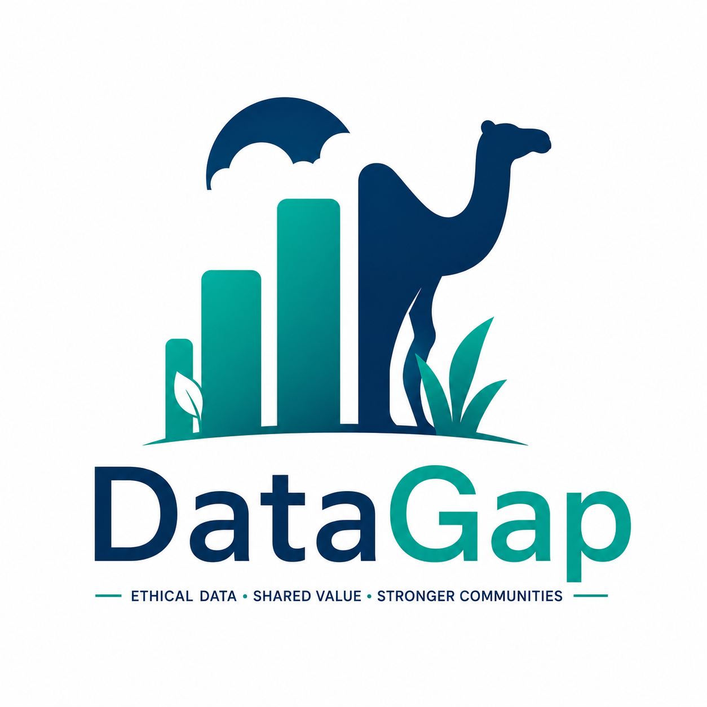
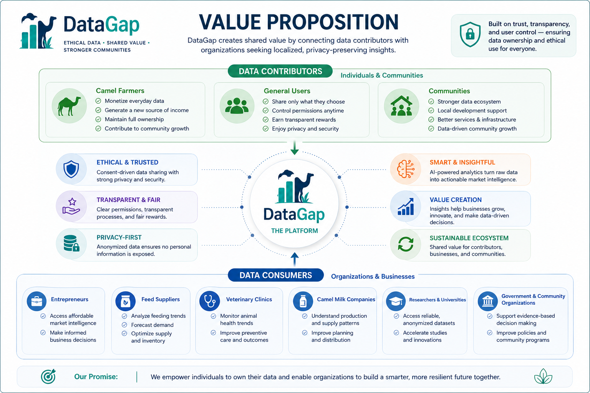

# DataGap

<p align="center">
  
</p>

<p align="center">
  <strong>Ethical Data Marketplace and Insight Platform for Rural Communities</strong>
</p>

**Challenge:** Challenge 3 - The data gap for local entrepreneurs  
**Track:** Digital solutions for rural communities  
**Community focus:** Al Quaa, Al Ain, UAE  
**Prototype type:** Working frontend demo simulation  

---

## Problem

Local entrepreneurs in rural communities often make decisions without reliable local data. They may not know what customers need, what products are in demand, what services are missing, or which problems are common in their own area. This creates a data gap: businesses are forced to guess instead of making evidence-based decisions.

In Al Quaa, this problem is especially relevant because many families run camel farms as a source of income. Camel farmers generate useful information every day, including camel health records, feeding costs, milk production, breeding notes, environmental conditions, and market prices. This data could help local entrepreneurs, veterinarians, feed suppliers, camel milk companies, researchers, and agri-tech teams make better decisions, but it is currently scattered, informal, and difficult to access responsibly.

---

## Solution

DataGap is a consent-based data exchange platform. Users choose which data categories they are willing to share, see estimated rewards, submit records or surveys, and retain control over their data. Companies and entrepreneurs access anonymized or aggregated insights instead of private user identities.

The prototype has two connected sections:

1. **Personal Data** - for everyday users who voluntarily share categories such as spending preferences, mobility patterns, digital preferences, local service needs, and surveys.
2. **Al Quaa Farm Records** - a dedicated local section for camel farmers, focused on camel health, feeding, milk production, breeding, environment, market prices, and local visitor demand.

This keeps the solution scalable while making it clearly built for Al Quaa and its people.

---

## Target Users

- Camel farmers in Al Quaa.
- Local entrepreneurs deciding what to sell, build, or improve.
- Feed suppliers, veterinarians, camel milk companies, agri-tech startups, and researchers.
- Everyday users who want control over their data and rewards.
- Companies that need ethical access to local market and operational insights.

---

## What Makes DataGap Different

| Area | DataGap Approach |
|---|---|
| Data ownership | Users choose what they share and can delete their data. |
| Local relevance | The first specialized module is built around Al Quaa camel farming. |
| Company access | Companies see anonymized or aggregated insights, not direct identities. |
| Rewards | Users can see estimated value and simulated earnings from approved data. |
| Trust | Consent changes, admin review, and audit-style records are visible in the prototype. |
| Scalability | The same structure can support more rural communities and specialized modules. |

---

## Business Model

DataGap creates value for both sides of the market:

- **Users and farmers** receive compensation or reward credits for approved data contributions.
- **Companies and entrepreneurs** pay for access to anonymized datasets, local insights, surveys, and AI-generated reports.
- **DataGap** earns revenue through dataset access, subscription plans for company analytics, and managed research/survey services.

### Business Model Canvas

<p align="center">
  
</p>

### Value Proposition Canvas

<p align="center">
  
</p>

---

## Implemented Prototype

The current prototype is a static frontend simulation designed to demonstrate the full product flow end to end. It runs locally from `index.html` and uses browser `localStorage` to preserve demo state.

Implemented behaviors:

- Role-based simulation for user/farmer, company, and admin accounts.
- Role-specific navigation so each account sees only relevant pages.
- Consent management with live reward estimates.
- Personal-data and Al Quaa farm-record category selection.
- Manual data submission with file-upload simulation.
- Sponsored surveys that add rewards.
- Wallet balance, transaction ledger, and transfer request simulation.
- Buyer ranking that updates after company activity.
- Company marketplace with anonymized dataset preview.
- Dataset purchase simulation with user/farmer revenue share.
- Admin review workflow for approving or rejecting submissions.
- Consent audit log.
- Rule-based AI insight simulation.
- Delete-all-data control.
- Reset demo account control.
- Browser persistence after refresh.

---

## What Is Simulated

This is intentionally a polished demonstration build, not a production deployment.

Simulated:

- Real banking and wallet transfer processing.
- Real company payments.
- Production authentication.
- Legal data marketplace contracts.
- Real AI model/API calls.
- Enterprise-grade anonymization pipelines.

Working in the demo:

- All major screens and role flows.
- State changes and persistence.
- Reward calculations.
- Wallet ledger updates.
- Company purchase flow.
- Dataset previews.
- Consent audit log.
- Admin approval/rejection workflow.
- Survey rewards.
- Buyer ranking updates.
- Privacy/delete flow.

---

## Impact Claims

These claims are testable in the prototype:

| Claim | How to verify |
|---|---|
| Users can control what data they share. | Open **Permissions** and toggle categories. |
| Reward estimates react to consent choices. | Toggle permissions and watch the estimate change. |
| Users can submit data and earn rewards. | Open **Submit**, submit a record, then check **Wallet**. |
| Companies can preview anonymized data safely. | Switch to the company account, open **Marketplace**, and click **Preview rows**. |
| Companies can buy anonymized datasets. | Switch to the company account, open **Marketplace**, and click **Buy access**. |
| Farmer revenue share is recorded. | After a company purchase, open **Wallet** and review the ledger. |
| Buyer rankings update after purchases. | Open **Buyers** after company activity. |
| Admins can review submitted records. | Switch to the admin account, open **Review**, and approve or reject a submission. |
| Consent changes are auditable. | Toggle permissions, then check the audit log in the admin **Review** page. |
| Users can delete their data. | Open **Profile** and click **Delete all my data**. |
| Demo state persists after refresh. | Perform an action, refresh the page, and confirm the state remains. |

---

## Functional Requirements

| ID | Requirement | Status |
|---|---|---|
| FR-01 | Role-based user/farmer, company, and admin experience | Implemented |
| FR-02 | Display available data-sharing categories | Implemented |
| FR-03 | Enable and disable data-sharing permissions | Implemented |
| FR-04 | Live reward estimation based on selected categories | Implemented |
| FR-05 | Manual structured data submission | Implemented |
| FR-06 | File-upload simulation for manual submissions | Implemented |
| FR-07 | Wallet balance and transaction ledger | Implemented |
| FR-08 | Wallet transfer request simulation | Implemented |
| FR-09 | Buyer ranking | Implemented |
| FR-10 | Company data marketplace | Implemented |
| FR-11 | Dataset preview and purchase simulation | Implemented |
| FR-12 | Rule-based AI insight generation | Implemented |
| FR-13 | Admin review and approval workflow | Implemented |
| FR-14 | Consent audit log | Implemented |
| FR-15 | User profile and privacy controls | Implemented |
| FR-16 | Delete all user data | Implemented |
| FR-17 | Al Quaa farm-specific records and insights | Implemented |
| FR-18 | Browser persistence using localStorage | Implemented |

---

## Non-Functional Requirements

| ID | Requirement | Status |
|---|---|---|
| NFR-01 | Privacy by design | Demonstrated |
| NFR-02 | Transparent consent and reward explanation | Demonstrated |
| NFR-03 | Data minimization | Demonstrated |
| NFR-04 | Anonymized company-facing data | Simulated |
| NFR-05 | User control over permissions and deletion | Demonstrated |
| NFR-06 | Fast static frontend performance | Implemented |
| NFR-07 | Simple role-specific user experience | Implemented |
| NFR-08 | Maintainable frontend structure for hackathon scope | Implemented |
| NFR-09 | Scalable domain model for future modules | Documented |
| NFR-10 | Production-grade security and compliance | Future work |
| NFR-11 | Real payment processing | Future work |
| NFR-12 | Real AI analytics and anonymization pipeline | Future work |

---

## Feasibility and Deployment

DataGap is feasible as a staged rural deployment because the first version does not require complex automation, sensors, or expensive infrastructure. The most realistic pilot is a small web app operated with manual review and controlled onboarding.

### Pilot Plan

1. **Pilot group:** start with 10 to 20 Al Quaa camel farmers and 3 to 5 local data buyers such as feed suppliers, veterinarians, camel milk businesses, agri-tech teams, or local entrepreneurs.
2. **Data collection:** begin with manual submissions, short surveys, and optional file uploads rather than automatic tracking. This keeps the product simple, understandable, and safer for early users.
3. **Human review:** every submitted record is reviewed before it becomes part of any company-facing dataset or report.
4. **Anonymized outputs:** companies receive aggregated insights, anonymized rows, and summary reports rather than direct personal or farm identities.
5. **Reward handling:** early rewards can be handled as approved wallet credits or manual payouts before integrating a real payment gateway.
6. **Feedback loop:** farmers and buyers review whether the insights are useful, then the team improves categories, pricing, and reports.

### Deployment Requirements

| Area | Practical Approach |
|---|---|
| Hosting | Low-cost web app hosted on a standard cloud platform or university-supported server. |
| Database | PostgreSQL, Firebase, or Supabase for users, consent records, submissions, transactions, and dataset requests. |
| Authentication | Email/password or phone-based login, with roles for users/farmers, companies, and admins. |
| Admin operations | One reviewer can manually approve early submissions and handle deletion requests. |
| Data privacy | Store consent per category, keep audit logs, and expose only anonymized or aggregated outputs to companies. |
| Payments | Start with manual payout records; add payment integration only after legal and compliance review. |
| AI | Start with rule-based reports and simple statistical summaries; later connect a real AI analytics service. |

### Cost and Maintenance Assumptions

For a small pilot, the technical cost can remain low. A basic hosted web app, database, and storage layer can be operated with limited monthly cost. The larger cost is operational: onboarding farmers, reviewing submissions, validating data quality, and maintaining trust. This is manageable at pilot scale because the system intentionally starts with manual review instead of fully automated data trading.

Main maintenance tasks:

- Verify submitted records before using them in reports.
- Handle consent changes and data deletion requests.
- Monitor dataset quality and remove unreliable submissions.
- Update reward estimates based on buyer demand.
- Support companies when they request or purchase datasets.

### Key Risks and Mitigations

| Risk | Mitigation |
|---|---|
| Users may not trust the platform with data. | Use clear consent controls, show exactly what is shared, and allow deletion at any time. |
| Companies may worry about data quality. | Use admin review, category rules, and minimum dataset sizes before selling insights. |
| Privacy expectations may be misunderstood. | Show only aggregated/anonymized data and keep direct identities hidden from companies. |
| Payments may create legal complexity. | Begin with simulated/manual credits, then add real payouts only after compliance review. |
| Rural adoption may be slow. | Start with a small farmer group and demonstrate direct value through useful reports and rewards. |

This deployment path avoids the biggest early risks while still creating measurable value quickly.

---

## Scalability

DataGap is designed as one consent platform with specialized local modules.

- **More users:** expand from Al Quaa farmers to more residents, local businesses, and entrepreneurs.
- **More domains:** add modules for tourism, stargazing services, local events, agriculture, household services, and other rural needs.
- **More communities:** reuse the same consent, submission, marketplace, and AI-report structure in other rural communities after adapting the data categories.
- **More buyers:** allow vetted companies, researchers, suppliers, and public-sector partners to access approved aggregated insights.

Al Quaa camel farming is the first local module, but the model can be repeated for other communities and sectors.

---

## How to Run

No installation is required.

Open:

```text
index.html
```

Optional syntax check:

```bash
npm run check
```

---

## Recommended Demo Flow

Judges can verify the main flow in under five minutes:

1. Open **Home** and explain the two systems: personal data and Al Quaa farm records.
2. Open **Permissions** and toggle data categories.
3. Open **Submit** and submit a camel farm record.
4. Complete a sponsored survey.
5. Switch to the company account and open **Marketplace**.
6. Click **Preview rows** to show anonymized data.
7. Click **Buy access** to simulate a dataset purchase.
8. Switch to the admin account and open **Review**.
9. Approve or reject a submitted record.
10. Return to the user account and open **Wallet**.
11. Open **Buyers** to show updated buyer activity.
12. Open **Insights / AI Reports** and explain the simulated AI reports.
13. Open **Profile** and show delete-data and reset-demo controls.

---

## Tools Used

- HTML
- CSS
- JavaScript
- Browser localStorage for demo persistence
- Rule-based simulated AI insights

---

## Repository Structure

```text
.
├── index.html
├── styles.css
├── app.js
├── package.json
├── README.md
└── assets/
    ├── Logo.png
    ├── Business Model Canvas.jpg
    └── VPC.png
```

Screenshots and a demo video may be added before final submission. The current app runs from the files above.

---

## Evidence and Validation

- `npm run check` validates JavaScript syntax.
- Browser testing confirmed:
  - submissions create wallet credit,
  - survey completion adds reward,
  - company purchase creates revenue share,
  - wallet ledger updates,
  - buyer ranking updates,
  - admin review changes submission status,
  - consent changes appear in the audit log,
  - delete-data flow clears user-controlled data,
  - state persists after reload.

---

## Future Work

- Real backend API.
- PostgreSQL or managed database.
- Production authentication and role-based access control.
- Formal anonymization and aggregation pipeline.
- Real AI analytics service.
- Payment integration after legal/compliance review.
- Community pilot with Al Quaa farmers and local data buyers.

---

<p align="center">
  <strong>DataGap</strong><br>
  Empowering rural communities through ethical, user-controlled data sharing.
</p>
